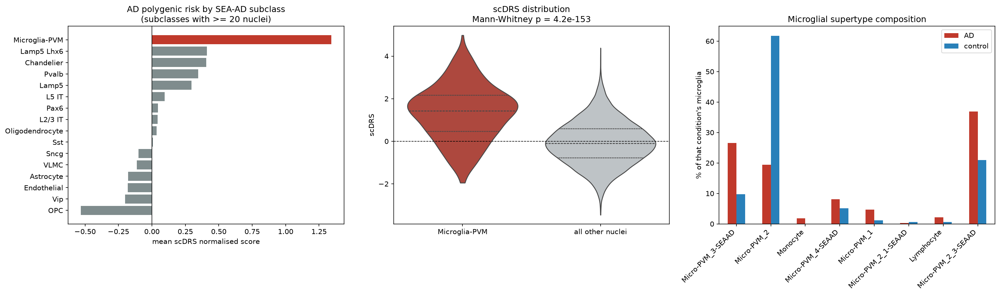

# Where does Alzheimer's genetic risk land in the entorhinal cortex?

An end-to-end pipeline that combines single-nucleus RNA-seq of human entorhinal cortex with
Alzheimer's disease GWAS summary statistics, and asks which cell types and cell states carry the
polygenic risk signal.

The short answer: **overwhelmingly microglia, as a cell type.** There is no evidence here that the
specific "causal" glial states proposed by Green *et al.* (2024) — Mic.12, Mic.13, Ast.10 — carry more
inherited risk than the rest of their cell type once the shared gene *APOE* is accounted for.

## What it does

| Stage | Notebook | What happens |
|---|---|---|
| 01 | [`01_preprocessing.ipynb`](notebooks/01_preprocessing.ipynb) | Load GSE138852 (13,214 nuclei × 10,850 genes), QC metrics, CP10K + log1p |
| 02 | [`02_clustering.ipynb`](notebooks/02_clustering.ipynb) | HVGs, PCA, UMAP, Leiden clustering |
| 03 | [`03_gwas_qc.ipynb`](notebooks/03_gwas_qc.ipynb) | GWAS QC (strand-ambiguous, autosomes, MAF, rsID), Manhattan + QQ |
| 04 | [`04_magma_gene_analysis.ipynb`](notebooks/04_magma_gene_analysis.ipynb) | MAGMA variant→gene annotation and gene-level association |
| 05 | [`05_marker_scoring.ipynb`](notebooks/05_marker_scoring.ipynb) | Mic12 / Mic13 / Ast10 glial state marker scores |
| 06 | [`06_scdrs.ipynb`](notebooks/06_scdrs.ipynb) | scDRS: per-nucleus polygenic risk vs 1,000 matched control gene sets |
| 07 | [`07_mapmycells_integration.ipynb`](notebooks/07_mapmycells_integration.ipynb) | Allen SEA-AD reference labels; risk by cell type and microglial supertype |
| 08 | [`08_enrichment_test.ipynb`](notebooks/08_enrichment_test.ipynb) | Do the high-risk nuclei sit in the disease-associated states? |

Data sources: GEO [GSE138852](https://www.ncbi.nlm.nih.gov/geo/query/acc.cgi?acc=GSE138852)
(Grubman *et al.* 2019) and GWAS Catalog
[GCST90027158](https://www.ebi.ac.uk/gwas/studies/GCST90027158) (Bellenguez *et al.* 2022),
with reference cell-type labels from Allen Institute
[MapMyCells](https://knowledge.brain-map.org/mapmycells/process).

## Results



**1. The GWAS behaves as expected.** 21.1 M variants → 7,356,090 after QC; 4,683 genome-wide
significant, led by the APOE locus on chr19 (−log₁₀p ≈ 114) and BIN1 on chr2. MAGMA finds 147
genes past Bonferroni (p < 2.7×10⁻⁶), topped by *APOC1*, *APOC2*, *INPP5D*, *BCL3* and *MS4A6A*.

**2. Reference labels agree with the author annotation.** Mapping every nucleus to the Allen
SEA-AD MTG taxonomy reproduces the authors' coarse cell types for **98.2 %** of annotated nuclei
(n = 11,884; 96.8–99.8 % per type), and gives confident calls to the 925 `unID` and 405
`doublet` nuclei the authors left unassigned.

**3. AD polygenic risk concentrates in microglia.** scDRS group-level Monte-Carlo test,
95th-percentile score vs 1,000 matched control gene sets:

| SEA-AD subclass | nuclei | mean scDRS | MC p | MC z |
|---|---:|---:|---:|---:|
| **Microglia-PVM** | 668 | **+1.34** | **0.001** | **6.80** |
| Lamp5 | 129 | +0.30 | 0.007 | 2.86 |
| Lamp5 Lhx6 | 42 | +0.41 | 0.13 | 1.14 |
| Oligodendrocyte | 7,514 | +0.03 | 0.24 | 0.71 |
| Astrocyte | 2,461 | −0.18 | 0.66 | −0.44 |
| OPC | 1,394 | −0.53 | 0.97 | −1.84 |

0.001 is the smallest attainable MC p-value with 1,000 controls. Microglia average +1.34 against
−0.07 for all other nuclei (one-sided Mann-Whitney p = 4×10⁻¹⁵³). The result holds with the author
labels (`mg`: z = 5.69) and with unsupervised Leiden clusters (the microglial cluster 10: z = 5.76).
Only 2 individual nuclei pass FDR < 0.1 (44 at FDR < 0.2) — the signal is a population shift,
not a handful of outlier cells.

**4. Disease-associated microglial states expand in AD, but do not carry extra risk.**

| Microglial supertype | AD | control | odds ratio (AD) | Fisher FDR | scDRS MC z |
|---|---:|---:|---:|---:|---:|
| Micro-PVM_3-SEAAD | 85 | 34 | 3.34 | 6×10⁻⁸ | 5.60 |
| Micro-PVM_2_3-SEAAD | 118 | 73 | 2.20 | 2×10⁻⁵ | 5.39 |
| Micro-PVM_4-SEAAD | 26 | 18 | 1.62 | 0.18 | 6.31 |
| Micro-PVM_2 (homeostatic) | 62 | 215 | **0.15** | 1×10⁻²⁸ | 4.84 |

All four supertypes reach the MC floor because they are microglia, but their mean scores do not
separate disease-associated from homeostatic states: homeostatic Micro-PVM_2 (+1.68) scores as high
as Micro-PVM_3-SEAAD (+1.73), and the AD-expanded Micro-PVM_2_3-SEAAD is the lowest (+0.64). Mean
scDRS in microglia is also identical in AD and control donors (+1.34 vs +1.35, p = 0.89). The
homeostatic state is depleted about 7-fold in AD donors while SEA-AD disease-associated states
expand — see the caveat on composition below.

**5. The Mic.12 / Mic.13 / Ast.10 state test (the original project question).** Across all nuclei,
the top Mic13-score quartile carries more AD risk than the rest (Mann-Whitney FDR = 2×10⁻¹⁴), Mic12
weakly (FDR = 1×10⁻³), Ast10 not at all (FDR = 0.91). But that headline is misleading on its own:

- the effect is tiny (Spearman ρ = 0.09) and the high-Mic13 quartile is only 10 % microglia;
- *APOE* is both a Mic.12/Mic.13 marker and one of the top-1,000 scDRS risk genes (MAGMA Z = 7.4).
  **Within microglia**, Mic13 correlates with scDRS (ρ = 0.14, p = 3×10⁻⁴), but rebuilding the score
  without *APOE* removes it (ρ = 0.035, p = 0.37); Mic12 without *APOE* likewise (ρ = −0.03, p = 0.48);
- within astrocytes, Ast10-high nuclei do not carry more risk (p = 0.06).

The Mic13 score is nonetheless higher in AD than control microglia (+0.76 vs +0.44, p = 2×10⁻⁹),
consistent with Green *et al.*'s placement of Mic.13 downstream of amyloid. Read together: inherited
AD risk marks the microglial lineage, while the disease-associated states look like reactive states
rather than genetically primed ones — within the limits of this 12-donor pilot.

### Outputs

| Table (`results/tables/`) | Contents |
|---|---|
| `01_qc_summary.tsv` | nuclei, median genes / UMIs / % MT by condition |
| `02_cluster_composition.tsv` | Leiden cluster × author cell type × condition |
| `03_gwas_qc_summary.tsv` | variant counts through each QC filter |
| `04_magma_genes.tsv` | gene-level MAGMA Z and p for 18,626 genes |
| `05_marker_coverage.tsv` | which marker genes were found in the matrix |
| `07_cell_metadata.tsv` | **one row per nucleus**: author labels, Leiden, SEA-AD labels + confidence, scDRS score / p / FDR, state scores |
| `07_mapmycells_concordance.tsv` | author cell type × SEA-AD coarse type |
| `07_scdrs_group_stats.tsv` | scDRS MC association for subclass, supertype, author type and Leiden cluster |
| `07_microglia_supertypes.tsv` | per-supertype counts, AD enrichment and scDRS |
| `08_state_enrichment.tsv` | marker-state vs scDRS tests |

Figures are in `results/figures/`, one per stage (stage 04 has none).

## Layout

```
├── data/
│   ├── raw/            downloaded inputs          (git-ignored, ~770 MB — see data/README.md)
│   └── mapmycells/     MapMyCells web result      (committed — cannot be regenerated locally)
├── notebooks/          01 … 08, run in order
├── src/adpipe.py       shared paths + save_table / save_fig
├── interim/            rebuildable intermediates  (git-ignored)
├── results/
│   ├── tables/         small TSVs
│   └── figures/        PNGs
├── tools/              MAGMA binary + LD panel    (git-ignored — see tools/README.md)
└── run_pipeline.py     executes every notebook in order
```

Only `results/` is meant to be read directly. Anything in `interim/` can be deleted and rebuilt.

## Running it

```bash
python -m venv .venv
.venv/Scripts/pip install -r requirements.txt        # Linux/macOS: .venv/bin/pip
```

Then fetch the inputs described in [`data/README.md`](data/README.md) and the MAGMA binary
described in [`tools/README.md`](tools/README.md), and run:

```bash
python run_pipeline.py
```

Individual stages:

```bash
python run_pipeline.py 05 06 07
```

Expect roughly 30–35 minutes end to end, most of it MAGMA's gene analysis (~20 min) and the
GWAS QC (~4 min). Stage 04 skips itself if `interim/magma/` is already populated.

### The one manual step

MapMyCells is a web service, so stage 07 cannot run itself from scratch. Its first cell writes
`interim/mapmycells_raw_upload.h5ad`; upload that, then unpack the result into
`data/mapmycells/`. The result of that upload is committed to this repository, so a fresh clone
can run the whole pipeline without repeating it.

## Notes on method

**No cell filtering.** The GEO matrix is the authors' post-QC set. Notebook 01 confirms that a
conventional `<200 genes` / `>20% mitochondrial` filter would drop zero nuclei, so none is
applied — which also keeps the barcode set aligned with the one-off MapMyCells submission.

**scDRS is scored on normalised, not scaled, expression.** scDRS matches control gene sets on
mean and variance and weights by inverse variance, which assumes size-factor-normalised log1p
input. Notebook 02 therefore builds the scaled matrix on a throwaway copy and writes an object
whose `X` is still sparse log1p(CP10K), carrying only the embedding forward. This also keeps the
file at ~150 MB rather than 1.1 GB.

**The group-level scDRS test is reimplemented.** `scdrs.method.downstream_group_analysis` does
not run on the pinned stack: it calls `np.float_` (removed in NumPy 2), indexes arrays with float
ranks from SciPy ≥ 1.11, and its heterogeneity block assigns 1,000 null columns one at a time
through `DataFrame.loc`, which does not complete in reasonable time under pandas 3. Notebook 07
vectorises exactly what that function's association block computes — the 95th percentile of the
normalised score per group against the same percentile of each control set. The Geary's C
heterogeneity statistic is the one thing not reproduced.

**Condition and donor are confounded.** The UMAP separates several oligodendrocyte and astrocyte
clusters almost entirely by AD vs control. With 6 AD and 6 control donors and no donor-level batch
correction, a between-condition difference in cell-state *composition* (point 4 above, and
`02_cluster_composition.tsv`) cannot be separated from a donor or batch effect, and the Fisher
tests treat nuclei as independent. The scDRS cell-type association (point 3) does not depend on
condition labels and is not affected by this.

**Half the top GWAS genes are not in the expression matrix.** The GEO matrix holds only 10,850
genes, so of MAGMA's 18,626 genes 9,349 can be used, and 75 of the 147 Bonferroni-significant genes
are missing — including *TREM2*, *MS4A4E*, *MS4A2*, *MS4A3* and *ACE* (most of the rest are
*APOE*-locus neighbours carried by LD). scDRS therefore scores the top 1,000 genes *among those
measured* (Z 2.0–11.0). Losing microglial genes such as *TREM2* makes the microglia result
conservative rather than inflated; a full-transcriptome atlas (SEA-AD, ROSMAP) would remove this gap.

**The marker sets are small.** The Mic12 / Mic13 / Ast10 scores in notebook 05 use 3–5 hand-picked
genes, two of which are absent from this matrix. They are a descriptive axis, not a cell-state
call; notebook 07's reference-based labels are the trustworthy annotation, and notebook 08 reports
both.

## Citations

- Grubman A, *et al.* A single-cell atlas of entorhinal cortex from individuals with Alzheimer's
  disease reveals cell-type-specific gene expression regulation. *Nat Neurosci* 22, 2087–2097 (2019).
- Bellenguez C, *et al.* New insights into the genetic etiology of Alzheimer's disease and related
  dementias. *Nat Genet* 54, 412–436 (2022).
- de Leeuw CA, *et al.* MAGMA: Generalized Gene-Set Analysis of GWAS Data. *PLoS Comput Biol* 11,
  e1004219 (2015).
- Zhang MJ, *et al.* Polygenic enrichment distinguishes disease associations of individual cells in
  single-cell RNA-seq data. *Nat Genet* 54, 1572–1580 (2022). (scDRS)
- Gabitto MI, *et al.* Integrated multimodal cell atlas of Alzheimer's disease. *Nat Neurosci* 27,
  2366–2383 (2024). (SEA-AD reference taxonomy)
- Wolf FA, Angerer P, Theis FJ. SCANPY: large-scale single-cell gene expression data analysis.
  *Genome Biol* 19, 15 (2018).

## License

The code in this repository (notebooks, `run_pipeline.py`, `src/`) is released under the
[MIT License](LICENSE). The input datasets, the MAGMA software and the Allen Institute reference
data are not covered by it and remain under their providers' own terms — see
[`data/README.md`](data/README.md) and [`tools/README.md`](tools/README.md).
